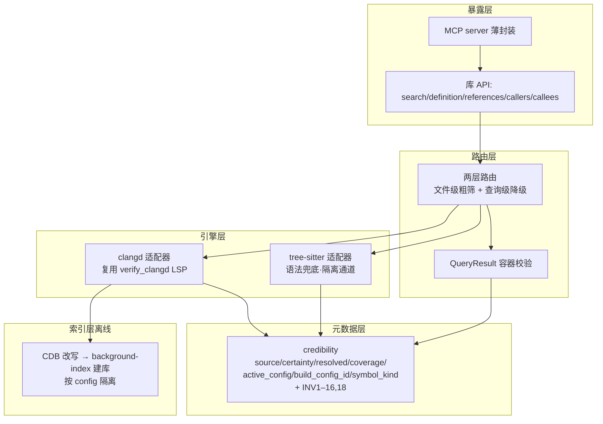

# CodeGraph 设计文档

## 0. 元信息
- 版本：v1.4（规范版；前身规范外迭代版至 DESIGN v1.3）
- 创建时间：2026-06-11
- 状态：**Frozen**（v1.3 冻结于 2026-06-11；v1.4 为 P1 实现期经 R1 变更后的修订，2026-06-13）
- 成熟度说明：本设计经三轮多 AI 架构 review + 一轮主系统对接 + 三轮规范化评审冻结为 v1.3；
  进入 Phase 1 开发后，多路代码 review（ChatGPT/Kimi/Gemini）发现冻结设计的一处契约矛盾
  （QR7×INV9）+ 一处虚假否定漏洞，经 R1 变更（change_2.md）修订为 v1.4。
- 前身：本文由 CodeGraph DESIGN v1.3（规范外迭代版）按公司设计规范模板重构而来。
- **v1.4 相对 v1.3 的变更**（R1 变更 change_2.md，P1 多路 review 发现）：
  - **[BLOCKER 修正] QR7 放宽**：candidate 的 relation 从 `==may` 改为 `∈{may, n/a}`
    （等价 `!=must`）。原 `==may` 与 INV9（entity⟹relation=n/a）在 entity 查询候选上
    不可联合满足，会让 P2 容器校验在最常见路径上撞不可满足契约。放宽保留"候选绝不 must"
    真意图，兼容 INV9。涉及 §4.1.4 QR7、§4.1.2 Candidate 注释。
  - **[MAJOR 修正] 新增 INV20**：not_found ⟹ clangd ∧ semantic ∧ ¬blind_spot_affects_result。
    把 INV12（tree-sitter 不能 not_found）泛化为系统立身之本：只有 clangd 语义无盲区才能
    断言"不存在"。补全了 log_search/exact_syntactic 预留只守 certainty（INV19）没守 not_found
    的半截漏洞——原本 clangd+syntactic、log_search 等三种虚假否定能过校验。
  - **[MINOR 修正] 新增 INV21**：resolved≠not_found ⟹ negative_scope=none ∧ ¬is_exhaustive。
    coverage 负证明字段只在 not_found 有意义，禁 positive/unresolved 结果夹带负证明语义。
  - 三条修订均不破坏现有工厂/测试（唯一合法 not_found 工厂 clangd_not_found 本就
    clangd+semantic+¬blindspot）；P1 代码随之加 INV20/21 检查 + 测试。
  - change_1.md 的两项（INV14a 冗余、make_error source 占位）仍按"零改动加注"处理，与本次无关。
- **v1.3 相对 v1.2 的变更**（第三轮三 AI 评审收敛；三份均判"补完即可冻结"）：
  - 删除 §4.1.2 Candidate 代码块的重复粘贴残留（致命：Codex 复制会编译失败）。
  - §2.1 声明 `from __future__ import annotations` 必要性（修 3.10 下 `X|None` dataclass 运行时崩溃）。
  - 统一 §5.2 与 §4.1.5 的 MCP 默认传输（stdio，非监听）。
  - 修 INV14a "禁 global" 措辞（negative_scope 枚举本无 global 值）。
  - 补 INV19（exact_syntactic⟹log_search）+ 预留值处理规则（check_invariants 对 log_search/
    exact_syntactic 放行，不写死白名单，避免二期破坏冻结）。
  - §4.4 缺要素1 降级候选必须带 DEPENDENCY_INCOMPLETE note（与缺要素4 的 SYMBOL_AMBIGUOUS 对称）。
  - §4.3 状态表拆开 INDEX_INCOMPLETE/INDEX_UNKNOWN、补全所有新增 IssueCode、加非 OK 状态填值规范。
  - §10 验收清单补 INV19、预留值边界测试、QR9 显式、from __future__ 项；缺要素1/4 note 对称。
  - §7 P6 明确 P4 syntax helper 缺失时要素2 的降级处理。
  - 其余次要项仍登记于附录 A。
- **本版评审结论：三份独立评审均判"可冻结进开发"，剩余仅文档级笔误（已修）。**

---

## 1. 需求理解

### 1.1 核心目标
构建 **CodeGraph**：一个本地化的 C/C++ 代码智能服务。给定代码库，提供符号定位、
定义/引用、调用关系、影响面等查询；**每条结果携带"可信度元数据"**，由上层消费方
据此决定它能支撑多强的结论。

核心价值（区别于普通 LSP 封装或语法级代码检索工具）：
- **clangd 语义层为主、tree-sitter 语法层兜底**的双引擎，按查询动态降级。
- **诚实的可信度标注**：严格区分 not_found（确认没有）vs unresolved（看不到），
  防止消费方把"看不到"当成"没有"而产生虚假否定。

### 1.2 用户与场景
- **目标使用者**：AI Agent / LLM（通过 MCP），以及 Python 业务系统（通过库 import）。
- **第一使用者**：诊断系统（Kona Defect Agent）—— 用 CodeGraph 提供的代码事实做缺陷
  根因分析、调用链回溯、日志基线对比。但 CodeGraph **设计上保持通用**，不绑定该业务。
- **代码域**：Tizen 平台 C/C++（嵌入式 Linux，宏密集，GBS 交叉编译，ARM 目标）。

### 1.3 范围（In Scope / Out of Scope）

**In Scope（MVP 第一批，见 §7 Phase 拆分）：**
- 双引擎路由（clangd 主 + tree-sitter 兜底 + 查询级降级）。
- 可信度元数据 + 强制不变量（防虚假否定）。
- 离线全局索引（clangd background-index）+ 在线查询。
- 接口：search_symbol / get_definition / find_references / find_callers / find_callees。
- 库 API + MCP 薄封装双形态。

**Out of Scope（二期，登记不实现，见 §3.5 二期清单）：**
- locate_log_statement（业务对接接口，需求已定义见 §4.1.7，二期实现）。
- clangd-indexer 只读 .idx 分发模型、逐 TU 索引台账、增量索引。
- get_impact 精度提升、精确宏展开 location、build_config 完整多 variant、
  owning_tu、edge_mechanism、staleness 检测。

**永不在 Scope（边界铁律）：**
- **判责逻辑**：不判断"是不是 bug / 谁的责任"。`must` 只表示"静态调用关系确定"，
  不等于"判责级证据"。判责是消费方的事。
- LLM 推测性总结：输出确定性地从 clangd/tree-sitter 派生。
- **综合 / 推理 / 生成**：CodeGraph 只供"代码事实块"（符号位置、调用边、引用、日志打印点），
  **不**把这些事实编织成流程图、调用链叙事、知识图谱、根因推理。这些综合是消费方
  （主系统/诊断 agent）拿 CodeGraph 的查询结果自己拼出来的。例：`locate_log_statement`
  告诉你"这条日志在某函数打印"、`find_callers` 告诉你"该函数被谁调"，是事实；把它们
  连成"日志→函数→调用链→根因"的流程图，是消费方的推理，不在 CodeGraph。
  （此边界是 CodeGraph 保持通用、可被多项目复用的前提——别的项目用得上"谁调谁"，
   但未必用得上诊断业务专属的流程图。）

### 1.4 假设与未决问题
- [ASSUMPTION] tree-sitter 的 Python binding 在目标内网环境可获取。若不可得，
  tree-sitter 兜底安全降级为"不给候选，直接 unresolved + blind_spot"（见 §3.2 引擎层）。
- [ASSUMPTION] 消费方（含 MCP agent）会读取并尊重 `consumer_warning=not_evidence` 标记；
  该假设需消费方侧集成测试验证（主系统侧已认领，见 §4.1.8 约束 C-3）。
- [OPEN] clangd-indexer 路线（二期）需安装 clang-tools-18（~9MB），内网可得性未确认；
  MVP 不依赖它，用 background-index（已实测，零额外依赖）。
- [OPEN] 真实 unipicture 代码库（比已测的 gstreamer 大）的索引规模/耗时为外推估算，
  首建峰值内存（~2GB/gstreamer）可能需 `-j` 压并行度，待真机确认。

---

## 2. 技术栈与约束

### 2.1 语言 / 框架 / 版本
- **语言**：Python 3.10+。
  **[契约] 所有使用 `X | None` 联合类型注解的模块顶部必须加 `from __future__ import annotations`**
  （否则 3.10 运行时 dataclass 解析 `str | None` 会 TypeError）；或等价改用 `typing.Optional`。
  统一用前者（PEP 563 延迟注解求值）。
- **核心模块纯标准库**（credibility、路由、引擎适配层）：**不得引入第三方运行时依赖**
  （pydantic、attrs 等一律不用）。原因：服务要在内网受限环境（仅 stdlib）可运行、可审计。
  此约束经多轮 review 确认坚持（手写 dataclass + check_invariants，模块化实现）。
- **允许的例外**：(1) tree-sitter 的 Python binding（解析器，非框架），不可得时可降级；
  (2) MCP server 层若需 MCP SDK/协议库，仅限 mcp_server.py 使用，核心库不依赖；
  内网不可得时可手写 stdio JSON-RPC 或只提供库 API 形态（见 §6 R-依3）。核心模块
  （credibility/routing/engines/indexing/api）始终纯 stdlib。
- **clangd**：宿主机 `Ubuntu clangd 18.1.3`（已实测）。
- 测试框架：pytest。

### 2.2 部署环境
- 本地化服务，CodeGraph 作为**常驻服务**运行（消费方查询时秒级加载已建好的索引）。
- 离线索引建库由 CI / 定时任务执行（GBS build → CDB 改写 → background-index 建库）。
- 双形态：库 API（被 Python 业务 import）+ MCP server（独立运行，接多种 agent）。

### 2.3 关键依赖（复用资产，见 §3.2 / §4.2）
以下已完成并测试，**直接复用，不重写**：
- `cdb_rewriter.py`：GBS chroot CDB → 宿主机 clangd 可用 CDB（双 arch 实测）。
- `verify_clangd.py`：LSP 客户端 + 语义健全性验证（路由层复用其 LSP 协议层）。
- `codegraph/credibility.py` + `codegraph/factories.py`：可信度元数据 + 12 条不变量
  （28 测试通过）。本设计在其上增量扩展（§4.2）。

### 2.4 已验证的技术事实（作为论据，非待验证项）
实现时应**信任**这些结论，不重新质疑；精力放在待实现规格上。
1. clangd + GBS 交叉 sysroot 对真实 Tizen 代码做语义解析：双 arch（x86_64+ARM）实测
   errors=0、include-not-found=0、跨文件 definition 命中。
2. clangd 对函数指针回调，找不到静态调用者时诚实返回"找不到"，不指错目标。
3. 离线全局索引（background-index）：find_references 从单 TU 的 2 处扩展到跨 62 文件的
   389 处（ARM `gst_element_set_state`）；运行时秒级加载（≤10s）、加载峰值 512MB。
4. 可信度元数据 + 12 不变量：已实现，28 测试通过。

---

## 3. 架构设计

### 3.1 系统架构图



### 3.2 模块划分（层间职责边界 = 契约）
- **暴露层**：库 API + MCP 薄封装。核心逻辑在库，MCP 只做协议转换，两形态共用库代码。
- **路由层**：两层判定（§4.4 状态机）。把引擎原始结果翻译成带 credibility 的 CodeGraph
  结果；返回前强制过两道校验（单条 check_invariants + 容器 check_query_result_invariants）。
- **引擎层**：
  - clangd 适配器（语义）：复用 verify_clangd LSP 客户端，只提供"观察到的事实"
    （返回了什么、有无诊断、位置类型），**不下可信度结论**（结论由路由层据元数据规则填）。
  - tree-sitter 适配器（语法兜底）：只做符号定位/文件结构/名字候选，输出**只能**进
    syntactic_candidates 隔离通道，受护栏约束。binding 不可得时安全降级为不给候选。
- **索引层（离线）**：CDB 生成（GBS）→ cdb_rewriter → clangd background-index 建库，
  按 build_config 隔离目录。
- **元数据层**：credibility（字段 + INV1–16,18）+ §4.1 数据结构 + 引擎观察协议，
  是路由层与引擎层的共同依赖，最底层。INV17 已并入容器级 QR7。

### 3.3 数据流
```
查询请求
  → 路由层第一层：文件在 CDB 中且 clangd 能建 TU？
      否 → tree-sitter（search 自动 / 精确查询按需）
      是 → clangd 适配器查询（加载离线全局索引）
  → 路由层第二层：按 clangd 返回 + TU 诊断 + 符号性质判定证据等级
      （引擎异常 / 非空可信 / 非空降级 / 空→not_found或unresolved）
  → 填 credibility（含 coverage/active_config/build_config_id/symbol_kind）
  → tree-sitter 兜底（按查询类型，受四道护栏）补 syntactic_candidates（如需）
  → 组装 QueryResult
  → 强制校验：check_invariants(每条) + check_query_result_invariants(容器)
  → 返回
```

### 3.4 数据模型 / Schema
核心数据结构见 §4.1（接口契约）与 §4.2（元数据 schema，含 INV1–16,18）。
数据模型的**变更属冻结契约**，开发期不得修改（见 R2/R8）。

### 3.5 二期清单（已识别，登记，MVP 不实现）
locate_log_statement（需求已定义 §4.1.7）、clangd-indexer .idx 分发、逐 TU 台账、
增量索引、精确宏展开 location、build_config 完整 variant、owning_tu、edge_mechanism、
staleness 检测、get_impact 精度提升。**实现者不得在 MVP 实现这些。**
注意：build_config_id **最小版**（目录隔离）在 MVP；只有"完整多 variant 语义"在二期。

---

## 4. 接口契约（冻结，开发阶段不得修改）

> 本章对应原设计的全部 [契约] 内容。开发期间这些签名、字段、不变量、护栏**不得修改**；
> 如发现确有问题，按 R1 暂停并提 `docs/design_changes/change_N.md`，不得自行改。

### 4.1 对外 API

#### 4.1.0 基础类型
```python
@dataclass(frozen=True)
class Pos:
    line: int        # 0-based（LSP 对齐）
    character: int   # 0-based（LSP UTF-16 character 语义；MVP 按 character 计）

@dataclass(frozen=True)
class Range:
    start: Pos
    end: Pos

Path = str   # 绝对路径，os.path.realpath 解析符号链接后

@dataclass(frozen=True)
class SymbolId:
    usr: str | None   # clangd USR（若有）；tree-sitter 候选为 None
    name: str
    file: Path
    pos: Pos
```
**路径规范 [契约]**：对外返回一律绝对真实路径（realpath）；CDB 相对路径基于其 directory 解析。

#### 4.1.1 查询接口签名
```python
search_symbol(symbol: str, *, build_config_id: str, kind_filter: str | None = None,
              limit: int = 100, offset: int = 0) -> QueryResult        # entity
get_definition(symbol: str, file: Path, pos: Pos, *, build_config_id: str,
               allow_syntactic_fallback: bool = False) -> QueryResult  # entity
find_references(symbol: str, file: Path, pos: Pos, *, build_config_id: str,
                limit: int = 100, offset: int = 0,
                allow_syntactic_fallback: bool = False) -> QueryResult # entity
find_callers(symbol: str, file: Path, pos: Pos, *, build_config_id: str,
             limit: int = 100, offset: int = 0,
             allow_syntactic_fallback: bool = False) -> QueryResult    # relation
find_callees(symbol: str, file: Path, pos: Pos, *, build_config_id: str,
             limit: int = 100, offset: int = 0,
             allow_syntactic_fallback: bool = False) -> QueryResult    # relation
# get_impact 属二期(§1.3 Out of Scope)。MVP 接口存在但仅桩实现:
#   返回 status=UNRESOLVED + notes=[Note(IssueCode.NOT_IMPLEMENTED_MVP, "get_impact 二期")]。
#   MCP 不暴露 impact 工具(见 §4.1.5)。
get_impact(symbol: str, *, build_config_id: str, limit: int = 100) -> QueryResult  # 二期·MVP桩
```
- **参数命名统一为 `symbol`**（含 search_symbol，原 `name` 已改；与 QueryMeta.symbol 一致，
  避免组装 query 时字段名不匹配触发 QR6 失败）。`symbol` 名 + `file/pos` 共同定位：
  file/pos 给 clangd 精确定位，`symbol` 名用于结果校验与 tree-sitter 兜底匹配。
- **`build_config_id` 必填 [契约]**：所有查询显式传入（绑定一套配置/索引，见 §6.3）。
  库 API 由调用方传；**MCP 层由 server 启动配置注入，不暴露给 agent**（见 §4.1.5）。
  这与 §4.1.2 QueryMeta.build_config_id 必填、QR6 一致性校验对齐。
- `query_kind`（entity/relation）由接口自动填，调用方不指定。
- `limit/offset` + `QueryResult.total_hits`：防大符号（malloc/NULL）命中数千条撑爆上下文。
  `total_hits`：clangd 返回时尽力统计；超限或不可行（LSP references 不返回总数）时为 None
  （此时消费方可继续翻页直到返回空）。
- `kind_filter`（search_symbol）：接受**简化名** `{"function","variable","type","macro"}`
  （大小写不敏感，不支持通配），内部映射到 symbol_kind 枚举
  （function→ordinary_function、variable→ordinary_variable、type→type、macro→macro）；
  None 表示不过滤。LocationResult.kind 返回**完整 symbol_kind 枚举值**（如 ordinary_function）。
- `allow_syntactic_fallback`：精确查询默认 False（不补 tree-sitter 候选）；search_symbol
  无此参数（本就自动补，见 §4.4 护栏触发规则）。
- **find_callers/find_callees [契约]**：用 LSP `callHierarchy/incoming|outgoingCalls`
  （prepareCallHierarchy 后），**不**用 references+AST 自行推导。clangd 不支持 callHierarchy
  时 → status=FAILED + notes=CALLHIERARCHY_UNSUPPORTED（不触发兜底）。

#### 4.1.2 返回结构
```python
class QueryStatus(str, Enum):
    OK = "ok"; NOT_FOUND = "not_found"; UNRESOLVED = "unresolved"
    FAILED = "failed"; INVALID_REQUEST = "invalid_request"  # 参数非法/路径越界(见 §5.2)

class IssueCode(str, Enum):                # notes 的结构化码,消费方据此稳定分支
    ENGINE_TIMEOUT = "engine_timeout"
    ENGINE_UNAVAILABLE = "engine_unavailable"
    CALLHIERARCHY_UNSUPPORTED = "callhierarchy_unsupported"
    TREE_SITTER_UNAVAILABLE = "tree_sitter_unavailable"  # binding 不可得,兜底降级
    INVALID_INPUT = "invalid_input"
    PATH_TRAVERSAL_BLOCKED = "path_traversal_blocked"
    INDEX_INCOMPLETE = "index_incomplete"
    INDEX_UNKNOWN = "index_unknown"            # index_health=unknown
    INDEX_SHARD_EXT_FALLBACK = "index_shard_ext_fallback"
    DEPENDENCY_INCOMPLETE = "dependency_incomplete"
    SYMBOL_AMBIGUOUS = "symbol_ambiguous"      # 符号身份歧义(缺要素4)
    FALLBACK_DISABLED = "fallback_disabled"    # 精确查询未开 allow_syntactic_fallback
    FALLBACK_SUPPRESSED_BY_SCORE = "fallback_suppressed_by_score"  # 候选全低于阈值
    NOT_IMPLEMENTED_MVP = "not_implemented_mvp"  # get_impact 等二期桩
    SOFT_WARNING = "soft_warning"              # 携带 soft_warnings 文本(泛化提示)

@dataclass(frozen=True)                    # [契约] 3.10 纯 stdlib：用 dataclass，不用 TypedDict
class QueryMeta:                           # query 字段结构化（替代裸 dict）
    kind: str                              # entity | relation
    symbol: str                            # 与接口参数 symbol 同名（避免组装错位）
    build_config_id: str
    file: Path | None = None
    pos: Pos | None = None

@dataclass
class Note:
    code: IssueCode
    detail: str = ""    # 人类可读补充(不用于分支)；[契约] 不得含源码片段/绝对路径/敏感信息

@dataclass
class QueryResult:
    query: QueryMeta
    status: QueryStatus
    status_credibility: Credibility  # 任何 status 都必填且必过 check_invariants。
                                     # OK 时：summary credibility，resolved=resolved（QR9）、
                                     #   source/certainty 取 semantic_results 中最强项、relation=n/a，
                                     #   仅作概览，逐条可信度看各 Result。
                                     # 非 OK：承载负证明/失败，resolved 按 QR5（INVALID_REQUEST
                                     #   占位规范见 §4.3）。
    semantic_results: list[Result]   # clangd 语义结果（status=ok 时非空）
    syntactic_candidates: list[Candidate]  # 非证据通道：tree-sitter 候选 + clangd 降级候选
    index_health: Literal["complete", "incomplete", "unknown"]
    total_hits: int | None           # 全局命中总数（分页）；clangd 尽力统计，不可行为 None
    notes: list[Note]                # 结构化提示（IssueCode + detail），消费方按 code 分支

@dataclass
class Result:
    data: "LocationResult | ReferenceResult | CallEdgeResult | ImpactResult"
    credibility: Credibility
    # 注：Result 无 consumer_warning（语义结果的可信度全在 credibility 里；
    #     消费方据 source/certainty/relation 判等级，见 §4.1.8 消费指引）。

@dataclass
class Candidate:
    data: "LocationResult | ReferenceResult"
    credibility: Credibility         # [契约] 候选 credibility 恒为：resolved=resolved（候选是
                                     #   "找到的疑似项"非负证明，避 INV3/4）、relation ∈ {may, n/a}
                                     #   （relation 候选用 may、entity 候选用 n/a；绝不 must）、
                                     #   certainty=syntactic。由 QR7 容器级强制（不在 check_invariants，
                                     #   因单条 Credibility 不知自己是否属候选）。
                                     # source 如实标：tree-sitter→tree-sitter(active_config=unknown)；
                                     #   clangd 降级候选→clangd(certainty=syntactic, active_config 按实填，
                                     #   表示语义引擎降级输出的语法级结果)
    relevance_score: int | None      # 护栏3 评分（tree-sitter 候选需要；clangd 降级候选可 None）
    consumer_warning: Literal["not_evidence"]   # 恒为 "not_evidence"
```
说明：`Literal` 来自 typing（3.10 标准库，纯 stdlib 可用）。**QueryMeta 用 @dataclass 实现
（已拍板，不用 TypedDict/NotRequired）**——避免 3.10/3.11 实现分叉。

#### 4.1.3 各查询 data schema（MVP 冻结；二期结构不在此）
```python
@dataclass
class LocationResult:   # get_definition / search_symbol / 候选
    symbol_id: SymbolId; range: Range; kind: str   # 取 symbol_kind 枚举值(§4.2.1)
@dataclass
class ReferenceResult:  # find_references 每处引用
    range: Range; file: Path
    kind: str           # declaration | definition | reference（与 LSP 对齐）
@dataclass
class CallEdgeResult:   # find_callers / find_callees 每条边
    from_symbol: SymbolId; to_symbol: SymbolId; call_site: Range
    # 方向语义：find_callers → from=caller, to=查询符号；find_callees → from=查询符号, to=callee
@dataclass
class ImpactResult:     # get_impact（二期），MVP 桩不产出此结构
    affected_symbol: SymbolId; distance: int   # distance=调用图最短跳数，-1=不可达（二期细化）
```
> LogSiteResult（locate_log_statement 的输出）是**二期结构，不纳入 MVP 冻结**，
> 草案见 §4.1.7（标注未定稿，二期实现时再定型）。

#### 4.1.4 校验要求（两道独立防线，缺一不可）
- **(1) 单条 credibility**：QueryResult.status_credibility 与每个 Result/Candidate 的
  credibility **必须**过 `check_invariants`（§4.2 的 INV1–16；候选专属约束在 QR7，不在此）。
- **(2) 容器一致性** `check_query_result_invariants()`（路由器返回前**必须**调用）：
  - QR1: `status==OK ⟺ len(semantic_results)>0`
  - QR2: `status ∈ {NOT_FOUND,UNRESOLVED,FAILED,INVALID_REQUEST} ⟹ len(semantic_results)==0`
  - QR3: `status==NOT_FOUND ⟹ len(syntactic_candidates)==0`
  - QR4: `status ∈ {FAILED, INVALID_REQUEST} ⟹ len(syntactic_candidates)==0`
  - QR5: `status==NOT_FOUND ⟹ status_credibility.resolved==not_found`；
         `status∈{UNRESOLVED,FAILED,INVALID_REQUEST} ⟹ status_credibility.resolved==unresolved`
  - QR6: 所有 Result/Candidate 的 build_config_id 与 query.build_config_id 一致
  - QR7（护栏4 + 候选身份约束，**取代原 INV17**）: `∀c ∈ syntactic_candidates:
         c.credibility.resolved==resolved ∧ c.credibility.relation ∈ {may, n/a}
         ∧ c.credibility.certainty==syntactic`
         （候选恒为"找到的疑似项"：不参与负证明、**绝不声称 must（必然关系）**、永远语法级。
          relation 取 {may, n/a}：relation 候选用 may，entity 候选用 n/a——因 entity 查询
          受 INV9 约束必须 relation=n/a，故 QR7 不能强求 may，只能禁 must。
          为何在容器级而非 check_invariants：单条 Credibility 不知自己是否属候选，
          只有容器知道它在 syntactic_candidates 列表里。）
  - QR8: 所有 Result/Candidate 的 credibility.query_kind 与 query.kind 一致
  - QR9: `status==OK ⟹ status_credibility.resolved==resolved`
         （防 OK 容器挂一个 resolved=unresolved 的 summary credibility）
- **说明：status=OK 时 syntactic_candidates 可并存非空**（语义结果 + 部分降级候选）；
  此时消费方以 semantic_results 为准、候选仅作启发。`search_symbol` 若只有候选无语义结果，
  status=UNRESOLVED + syntactic_candidates 非空，这是**合法的可用搜索结果**（消费方据
  consumer_warning=not_evidence 知其为启发，非"查无此符号"）。
- 路由器不得绕过任一防线返回。

#### 4.1.5 MCP 工具映射表
| MCP 工具 | 库 API | 关键参数（build_config_id 由 server 配置注入，不暴露给 agent） |
|---|---|---|
| `search` | search_symbol | symbol, kind_filter, limit, offset |
| `definition` | get_definition | symbol, file, pos, allow_syntactic_fallback |
| `references` | find_references | symbol, file, pos, limit, offset, allow_syntactic_fallback |
| `callers` | find_callers | symbol, file, pos, limit, offset, allow_syntactic_fallback |
| `callees` | find_callees | symbol, file, pos, limit, offset, allow_syntactic_fallback |
（`impact` 工具**二期才暴露**；MVP 的 MCP server 不注册它，避免暴露无底层支持的 dead tool。）
**[契约] agent 提示**：MCP 工具返回描述必须含一句："syntactic_candidates 仅作启发，
带 consumer_warning=not_evidence，不得作为确定性证据使用。"
**[契约] MCP 传输与安全**：MCP server **默认 stdio 模式**运行（无网络监听、无暴露面），
适合本地 agent 直连；仅当显式启用 SSE/HTTP 模式时才绑定 127.0.0.1 或 Unix Domain Socket
（不对外）。任一模式都对协议参数做类型/长度/范围白名单校验（见 §5.2）。

#### 4.1.7 locate_log_statement 需求规格（二期·主系统侧已定义）
**用途**：定位一条报错日志的代码打印点，用于回溯调用链 / 日志基线对比。
```python
locate_log_statement(log_text: str, *, tag: str | None = None,
                     build_config_id: str, limit: int = 20) -> QueryResult
```
- **核心难点：格式串反向匹配**。代码 `LOGE("decode failed: %d, ret=%d", e, r)`，
  运行时日志 `decode failed: -1, ret=22`。必须把运行时日志反向匹配到带占位符的格式串
  （%d/%s/%p 当通配）。**实现路径：tree-sitter/grep 找字符串字面量即可，不必用 clangd。**
- **可信度标注 [契约·避免与 INV2 冲突]**：日志匹配靠 tree-sitter/grep，**不是 clangd 语义**，
  故即使精确命中也**不得标 certainty=semantic**（否则违反 INV2: semantic⟹clangd）。
  二期需为日志匹配引入独立来源标注 `source=log_search` + `certainty=exact_syntactic|syntactic`，
  或全部走 syntactic_candidates 通道。match_confidence(exact/format_string_match/fuzzy)
  映射到这套语法级 certainty，**不映射到 semantic**。
- **多义诚实**：同一格式串多处出现时**全返回 + 标多义，绝不瞎指一个**。
- **LogSiteResult 草案（二期未定稿，不纳入 MVP 冻结）**：
  ```
  site_range: Range; enclosing_symbol: SymbolId
  matched_format_string: str; match_confidence: exact | format_string_match | fuzzy
  ```

#### 4.1.8 主系统对接约束（消费方侧认领，记录，不改 CodeGraph）
- **C-1**：MVP（background-index）下 not_found 实际只到 current_tu 级；项目级排除法
  消费方需降级为 BEST_EFFORT，等二期 clangd-indexer。
- **C-2**：build_config_id 标配置不标代码版本；索引版本一致性由消费方自管（或等二期 staleness）。
- **C-3**：消费方须集成测试验证 syntactic_candidates 真被当非证据处理（防 LLM 固化为事实）。
- **consumer_hint**：消费方贴业务标注的开放 dict（runtime_confirmed / claim_id /
  ticket_id / verdict_relevance）；**CodeGraph 永不读、永不填**。

### 4.2 内部模块接口（元数据 schema + INV1–16,18）

#### 4.2.1 Credibility 字段
```python
source:      clangd | tree-sitter | log_search
             # log_search 为二期日志匹配预留(见 §4.1.7)，现在就纳入枚举避免二期破坏冻结 schema；
             # MVP 不产出 log_search，但 schema 先容纳，certainty 配 syntactic/exact_syntactic。
certainty:   semantic | syntactic | exact_syntactic
             # exact_syntactic 为日志精确串匹配(二期)预留；MVP 只用 semantic/syntactic。
relation:    must | may | n/a
resolved:    resolved | not_found | unresolved
             # 注：QueryStatus.FAILED/INVALID_REQUEST 映射到 resolved=unresolved（见 QR5），
             #     resolved 本身不设 failed 值（失败在 QueryStatus 层表达）。
query_kind:  entity | relation
symbol_kind: ordinary_function | ordinary_variable | type | macro
           | func_pointer | virtual | weak | inline_asm | cross_so | unknown
             # 可穷尽集合 = {ordinary_function, ordinary_variable, type}
             # 注：func_pointer 等是"该符号在本查询语境下的解析性质"，非纯类型分类；
             #     不可穷尽集合用于 INV15 钳制 not_found。
dependency:  DependencyScope
   level:   query_local | translation_unit | global | n_a   # 依赖闭包粒度（n_a=参数错误等无关场景）
   status:  complete | incomplete | unknown
   missing: list[str]   # status=incomplete 时非空(缺失头/TU 的绝对路径或 TU 标识符字符串)；
                        # status=complete 时必为空；见 INV18
coverage:    Coverage
   index_scope: current_tu | indexed_project | global | external_known | external_unknown
   is_exhaustive_within_scope: bool   # 该 scope 内是否已穷尽；unresolved 时无意义应为 False
   negative_scope: current_tu | indexed_project | none   # not_found 时必填(否则 none)
active_config: host | target | mixed | unknown
             # mixed: 查询对象为文件级且含多套 #ifdef 分支，无单一 active config
             # 判定依据: clangd 当前 target triple 的预定义宏集合，非物理机架构
index_health:   complete | incomplete | unknown   # 由 §6.3 粗判给出（QueryResult 也冗余暴露）
   # [契约] 真值表（与 §6.3 一致）：
   #   shards >= TU_count            ⟹ "complete"
   #   shards <  TU_count            ⟹ "incomplete"
   #   索引目录不存在/建库未完成/异常 ⟹ "unknown"
index_backend:  background-index | clangd-indexer  # MVP 恒 background-index；INV14 据此钳制
build_config_id: str   # 最小版：CDB 文件名或 hash，如 "arm"/"x86"
blind_spot_nearby: bool          # 附近有盲区（信息性，不降级）
blind_spot_affects_result: bool  # 盲区影响本结果（进硬不变量，触发降级）
consumer_hint: dict | None       # 消费方扩展点，CodeGraph 不填
```
**negative_scope 语义 [契约]**："在哪个范围内确认没有"（负证明范围），≠ index_scope
（符号物理发现位置）。external_known 只能作 index_scope，不能作 negative_scope。
**[契约] index_health / index_backend 是 INV14 的承载字段**——没有它们 INV14 无法自动校验，
故纳入 Credibility（index_health 同时在 QueryResult 冗余暴露给消费方，二者一致）。

#### 4.2.2 不变量 INV1–INV16, INV18–INV21（check_invariants 强制；INV17 已并入容器级 QR7）
```
INV1  tree-sitter ⟹ syntactic            INV2  semantic ⟹ clangd
      （INV2 是【单向】蕴含：source=clangd 且 certainty=syntactic 是合法降级状态，
        见 §4.1.2 Candidate；不可反推 clangd⟹semantic）
INV3/4 not_found|unresolved ⟹ relation=n/a
INV5  blind_spot_affects_result ⟹ ¬semantic ∧ ¬must
INV6  not_found ⟹ dependency complete    INV7  dependency unknown ⟹ ¬not_found
INV8  must ⟹ semantic                     INV9  entity query ⟹ relation=n/a
INV10 tree-sitter ⟹ dependency ≠ incomplete
INV11 must ⟹ resolved                     INV12 tree-sitter ⟹ ¬not_found
INV13 not_found ⟹ is_exhaustive_within_scope ∧ negative_scope≠none
INV14 not_found ⟹ （拆成可独立测试的子句 14a/14b/14c）
   14a  negative_scope ∈ {current_tu, indexed_project}
        （negative_scope 枚举本身无 global 值，故不存在 global 级 not_found；
         此约束即"不可能对全局做诚实否定"，与 MVP 不可达 global 一致）
   14b  index_health ∈ {incomplete, unknown} ⟹ negative_scope ≠ indexed_project
   14c  index_backend=background-index ⟹ negative_scope ≠ indexed_project
        （即使 complete：粗判必要非充分，无逐 TU 台账）
   ⟹ MVP（background-index）下 not_found 实际只能 current_tu 级
INV15 not_found ⟹ symbol_kind ∈ {ordinary_function, ordinary_variable, type}
INV16 tree-sitter ⟹ active_config = unknown
INV18 dependency.status=incomplete ⟹ missing≠[]；status=complete ⟹ missing==[]；
      level=n_a ⟹ dependency 不参与 not_found 证明（not_found 时 level≠n_a）
INV19 certainty=exact_syntactic ⟹ source=log_search（二期日志匹配专用，clangd/tree-sitter
      不得用 exact_syntactic）。MVP 不产出 exact_syntactic/log_search，但 check_invariants
      对它们【放行】（视为合法但暂不产出），避免二期日志功能接入即破坏冻结契约。
INV20 not_found ⟹ source=clangd ∧ certainty=semantic ∧ blind_spot_affects_result=False
      （把 INV12 的「tree-sitter 不能 not_found」泛化为系统立身之本：只有 clangd 语义、
       且本结果不受盲区影响，才有权断言"不存在"。语法级/日志级/受盲区影响的结果一律
       不得 not_found——log_search/exact_syntactic 同样被此条挡住，补全了 INV19 只守
       certainty 没守 not_found 的半截预留。唯一合法 not_found 来源是 clangd 语义穷尽。）
INV21 resolved ≠ not_found ⟹ negative_scope = none ∧ is_exhaustive_within_scope = False
      （coverage 的负证明字段只在 not_found 时有意义；positive/unresolved 结果不得夹带
       负证明语义，防消费方误读、防 P2 路由 bug 漏出陈旧 coverage。）
（原 INV17 "Candidate⟹relation=may" 移至容器级 QR7——单条 Credibility 不知自己是否属候选，
  必须在容器扫 syntactic_candidates 列表时校验。）
兼容矩阵:
   negative_scope=indexed_project ⟹ index_scope ∈ {indexed_project, global}
   negative_scope=current_tu      ⟹ index_scope ∈ {current_tu, indexed_project}
        （放宽：单 TU 局部查询 index_scope=current_tu 合法；MVP 全项目索引下也可
         index_scope=indexed_project 但只对当前 TU 诚实否定负责）
   negative_scope=none            ⟹ resolved ≠ not_found
```
**[契约] 预留枚举值处理**：source 的 `log_search`、certainty 的 `exact_syntactic` 是二期预留。
MVP 的 check_invariants **不得写死** `source in ("clangd","tree-sitter")` 这类白名单否决——
应只对已定义的不变量求值，遇到预留值放行（INV19 仍校验 exact_syntactic⟹log_search）。
INV1（tree-sitter⟹syntactic）保证 tree-sitter 不会误用 exact_syntactic。
软检查 soft_warnings（非阻断）：clangd+依赖齐全+无盲区却 unresolved（corner case）；
blind_spot_nearby 但标不影响（提示复核）。
**实现要求 [契约]**：每个 INV 一个独立检查函数（模块化，非 200 行 if-elif）；
每条有"被拒非法组合 + 紧邻合法组合不误杀"两类单测。候选身份相关约束（原 INV17）在 QR7 测。

### 4.3 错误码 / 状态定义

CodeGraph 不抛业务异常给消费方，而是用 `QueryStatus` + `notes` 表达所有"非正常"情况：

| 状态 / 标记 | 触发 | 含义 | 消费方应对 |
|---|---|---|---|
| `status=FAILED` + `ENGINE_TIMEOUT/ENGINE_UNAVAILABLE/CALLHIERARCHY_UNSUPPORTED` | clangd 超时/崩溃/初始化失败/不支持 callHierarchy | 引擎异常，未观察 | 重试或降级；不触发兜底 |
| `status=INVALID_REQUEST` + `INVALID_INPUT/PATH_TRAVERSAL_BLOCKED` | 参数非法 / 路径越界（§5.2） | 请求不合法 | 修正参数 |
| `status=UNRESOLVED` | 看不到（盲区/依赖缺失/索引不足/全部不可信） | "看不到" ≠ "没有" | 触发降级 / 盲区补救（插桩） |
| `status=NOT_FOUND` | 确认没有（受 INV13-15 约束，MVP 仅 current_tu 级） | "确认没有" | 可作负证据（注意范围） |
| `DEPENDENCY_INCOMPLETE`（候选 note） | 缺要素1，依赖不完整降级入候选 | 依赖不全，候选风险高 | 不当事实，结合运行时复核 |
| `SYMBOL_AMBIGUOUS`（候选 note） | 缺要素4，符号身份歧义降级入候选 | 来源不唯一 | 不瞎选，需消歧 |
| `FALLBACK_DISABLED` / `FALLBACK_SUPPRESSED_BY_SCORE` | 精确查询未开兜底 / 候选全低于阈值 | 无候选给出 | 知会，可显式开兜底或调阈值 |
| `TREE_SITTER_UNAVAILABLE` | binding 不可得，兜底降级 | 缺语法候选能力 | 知会，结果仍可用（少候选） |
| `index_health=incomplete` + `INDEX_INCOMPLETE` | 索引分片数 < TU 数 | 索引可能漏 TU | 不信任项目级 not_found |
| `index_health=unknown` + `INDEX_UNKNOWN` | 索引未完成/目录不存在/异常 | 索引状态未知 | 不信任项目级 not_found |
| `INDEX_SHARD_EXT_FALLBACK` | 分片扩展名非 .idx，已回退统计 | 索引格式可能漂移 | 知会，结果仍可用 |
| `NOT_IMPLEMENTED_MVP` | get_impact 等二期桩 | MVP 未实现 | 等二期 |

**[契约] 非 OK 状态的 total_hits / index_health 填值**：FAILED/INVALID_REQUEST 时
`total_hits=None`（未观察，非 0）、`index_health` 填当前实际探测值（无则 `unknown`）。

**[契约] 引擎调用降级**：所有 clangd LSP 调用必须有超时（默认 30s，可配置）；
超时/错误一律 status=FAILED，不重试到死、不静默吞。
**[契约] 库 API 参数校验**：库 API 对参数错误（路径越界、非法 pos 等）返回
status=INVALID_REQUEST + 对应 IssueCode（不抛裸异常）；MCP 层据此映射为错误响应。
**[契约] INVALID_REQUEST / FAILED 的 status_credibility 最小占位**（参数/引擎错误与符号无关，
Credibility 必填字段填中性占位，仍须过 check_invariants）：
```
source=clangd, certainty=syntactic, relation=n/a, resolved=unresolved,
query_kind=与请求一致, symbol_kind=unknown,
dependency=DependencyScope(level=n_a, status=unknown, missing=[]),
coverage=Coverage(index_scope=external_unknown, is_exhaustive_within_scope=False, negative_scope=none),
active_config=unknown, index_health=unknown, index_backend=background-index,
blind_spot_nearby=False, blind_spot_affects_result=False, consumer_hint=None
```
（factories.py 提供 `make_error_credibility(query_kind)` 工厂，避免每处手填。）

### 4.4 路由状态机契约（冻结，开发期不得修改）

> 本节是路由层的判定契约（原散落于数据流/Phase DoD，现归入冻结契约）。
> 路由器填完 credibility 后**必须**过 check_invariants + check_query_result_invariants（§4.1.4）。

**第一层（文件/TU 级）engine eligibility：**
```
文件在 CDB 中 且 clangd 能建 TU → 进第二层（走 clangd）
否则（不在 CDB / 非 C/C++ / 无 TU） → tree-sitter：
   search_symbol 自动补候选；精确查询仅 allow_syntactic_fallback=True 才补
```

**第二层（查询级）evidence classification（分支顺序固定）：**
```
分支0 引擎异常（ResponseError/超时/断开/初始化失败/callHierarchy 不支持）：
   → status=FAILED, resolved=unresolved, notes=对应 IssueCode；【不触发兜底】

分支1 clangd 返回非空：逐结果验四要素
   要素1 该 TU 无 file-not-found/fatal 阻断诊断（= dependency complete 的可执行定义）
   要素2 位置在原始源码（非宏展开伪位置；MVP 用 tree-sitter AST preproc_* 近似判定）
   要素3 索引范围已知（填 coverage）
   要素4 符号身份明确（单 Location；多 Location 仅当合法重载才明确，否则歧义）
   → 降级真值表（每个不可信结果按缺失要素处理，**一律降级入 syntactic_candidates，不丢弃**）：
       缺要素1 → 该结果降级入候选(source=clangd,certainty=syntactic)，dependency 标
                 incomplete/unknown，**notes 必须加 DEPENDENCY_INCOMPLETE**（否则消费方只看
                 候选列表会低估依赖不完整风险）
       缺要素2 → 降级入候选 certainty=syntactic, blind_spot_affects_result=True
       缺要素3 → 保留语义但 coverage.index_scope=external_unknown，不声称 exhaustive
                 （要素3 单独缺失不降级 certainty，只影响 coverage）
       缺要素4 → 该结果降级入候选(source=clangd,certainty=syntactic,not_evidence)，
                 notes 加 SYMBOL_AMBIGUOUS；【不丢弃，也不当语义事实】
       （多要素缺失合并：缺要素1或2或4 → 该结果降级入候选；缺要素3 仅调 coverage）
   → 混合结果（references 多处）：可信的进 semantic_results；不可信的【降级入
       syntactic_candidates】（source=clangd, certainty=syntactic, resolved=resolved,
       relation=may, not_evidence；受 QR7），【绝不丢弃】
   → 容器状态：有可信语义结果 → status=OK（候选可并存）；
       全部不可信(无语义结果，仅候选) → status=UNRESOLVED（不进分支2，避免误判 not_found）
   → relation：精确调用边→must（仅 certainty=semantic）；经盲区/不确定→may

分支2 clangd 返回空：
   符号种类可穷尽（INV15）∧ 依赖闭包齐全 ∧ index_scope ∈ {indexed_project, global}
   ∧ index_health=complete
     → status=NOT_FOUND（但 INV14c：background-index 下 negative_scope 只能 current_tu）
   否则 → status=UNRESOLVED + blind_spot；按查询类型决定是否 tree-sitter 兜底

符号种类"不可穷尽"清单（永不 not_found，只 unresolved+blind_spot）：
   函数指针/回调、虚函数派发、weak symbol、内联汇编、跨 .so/dlsym、宏生成符号
```

**四道护栏（tree-sitter 兜底，对应 §4.1.4 QR3/4/7（原 INV17 已并入 QR7））：**
1. 物理隔离：候选只进 syntactic_candidates，不混 semantic_results。
2. 非证据标记：consumer_warning=not_evidence，certainty=syntactic，relation=may。
3. 低命中自闭（评分制，由 P4 引擎计算 relevance_score，P2 按阈值过滤）：
   精确查询四维（名字精确+15/同文件+10/同作用域+10/类型匹配+5）阈值 20；
   search_symbol 无 file/pos，独立阈值 15（精确名命中即展示）。全低于阈值 → 不给候选。
4. 不参与负证明：候选绝不支撑 not_found（QR7 + INV12）。

---

## 5. 非功能性需求

### 5.1 性能预算
| 路径 | 预算 | 来源 / 校验方式 |
|---|---|---|
| 离线建库（首建） | gstreamer 规模 ~50s；外推 unipicture(~5×) 分钟级 | 实测；集成测试中校验 |
| 首建峰值内存 | ~2GB（gstreamer）；可用 `-j` 压并行换内存 | 实测；CI 资源约束需注意 |
| 运行时索引加载 | ≤10s 给出完整跨 TU 结果（分片已在盘） | 实测；启动基准测试 |
| 运行时查询内存 | 加载期峰值 ~512MB | 实测 |
| 单次 LSP 查询 | 超时上限 30s（可配置），超时即 FAILED | 契约（§4.3） |
| 大结果保护 | limit 默认 100，防数千条命中撑爆消费方上下文 | 契约（§4.1.1） |

性能预算写入对应 Phase 的 DoD，UT/集成测试中校验（R7）。

### 5.2 安全要求
- **无密钥/Token/PII**：CodeGraph 处理代码与索引，不涉及凭据；严禁日志打印代码内容外的
  敏感信息。配置（如 clangd 路径、buildroot 路径）走参数/环境变量，不硬编码（R7）。
- **输入校验**：路径参数必须校验。realpath 后限制在**配置的 allowlist roots**内
  （`source_root` / `build_root` / `sysroot_roots` / `index_root` / 可配 `extra_readonly_roots`，全部 realpath 去重），而非单一 repo 根——
  因为 external_known 符号（Tizen sysroot 的头/定义）合法地不在 repo 根内，单根限制会误伤。
  越界路径 → status=INVALID_REQUEST + PATH_TRAVERSAL_BLOCKED。外部 root 标记只读。
  log_text（二期）作为搜索词，不进入任何 shell/SQL，避免注入。
- **MCP 层输入校验**：MCP server 接收外部 agent 请求，须对协议参数做类型/长度/范围白名单
  校验；**默认 stdio 模式（无网络监听）**，仅当显式启用 SSE/HTTP 模式时才绑定 127.0.0.1
  或 Unix Domain Socket、不对外暴露（与 §4.1.5 一致）。
- **子进程安全**：clangd 以子进程启动，参数来自受控 CDB，不拼接用户输入到命令行。

### 5.3 日志与可观测性
- **结构化日志**：关键路径（建库、查询路由、引擎调用、校验失败）打结构化日志
  （含 query_kind / build_config_id / 引擎 / 耗时 / status）。严禁打印代码正文片段超过
  必要范围、严禁打印任何凭据。
- **关键指标埋点**：查询成功率、各 status 分布（ok/not_found/unresolved/failed/invalid_request 占比）、
  引擎降级率（clangd→tree-sitter 兜底触发率）、index_health 分布、查询 P95 延迟、
  超时率。这些指标也是诊断 CodeGraph 自身健康的依据。
- **校验失败可观测**：check_invariants / check_query_result_invariants 抛错时，
  必须记录违反的具体不变量编号 + 触发的字段组合（便于定位路由层 bug）。

### 5.4 错误处理与降级策略
- **引擎超时/崩溃** → status=FAILED + notes，不触发 tree-sitter 兜底（不知 query 是否有效）。
- **依赖缺失/盲区** → unresolved（不是 not_found），按需触发 tree-sitter 兜底（受护栏）。
- **tree-sitter binding 不可得** → 兜底降级为"不给候选，直接 unresolved + blind_spot"
  （功能安全，只是少候选）。
- **索引不完整（index_health≠complete）** → 禁项目级 not_found，降为 current_tu 或 unresolved。
- **核心原则**：任何不确定一律向"看不到（unresolved）"降级，绝不向"没有（not_found）"
  误升，防虚假否定。

---

## 6. 风险评估

| 风险 | 影响 | 概率 | 缓解方案 |
|---|---|---|---|
| **R-技1：background-index 无逐 TU 台账，可能静默漏 TU** | 项目级 not_found 不可信，潜在虚假否定 | 中 | INV14 三重钳制：MVP 一律禁项目级 not_found，只给 current_tu 级；index_health 暴露风险；二期 clangd-indexer 给精确台账 |
| **R-技2：tree-sitter 自动兜底候选被 LLM 固化为事实** | 误导消费方判责 | 中 | 四道护栏（物理隔离/not_evidence/评分自闭/不参与负证明）+ 按查询类型触发（精确查询默认不补）+ 消费方集成测试（C-3） |
| **R-技3：宿主机 x86 解析 ARM 的 inactive #ifdef 分支** | 条件编译分支归属错误 | 中 | active_config 维度（host/target/mixed/unknown）；MVP 粗粒度，精确逐分支归属二期 |
| **R-技4：tree-sitter 对 C/C++ 宏/模板/条件编译误识别** | 候选噪音/误导 | 中 | 评分自闭（护栏3）+ 低 certainty(syntactic)+ relation=may + 不参与负证明；只作启发不作证据 |
| **R-技5：clangd 子进程崩溃/僵尸/句柄泄漏** | 查询失败、资源泄漏 | 中 | 超时（30s）+ 健康检查 + 异常退出自动重启；FAILED 状态如实暴露 |
| **R-技6：callHierarchy 在 clangd 18 的支持差异** | callers/callees 部分失效 | 中 | 不支持→FAILED+CALLHIERARCHY_UNSUPPORTED（不静默）；P8 须真机验证 callHierarchy 可用性 |
| **R-依3：MCP server 需 MCP SDK/协议库（非纯 stdlib）** | MCP 形态引入第三方依赖 | 中 | §2.1 列为允许例外（仅 MCP 层）；或手写 stdio JSON-RPC 保纯 stdlib；内网可得性待确认，不可得则只提供库 API 形态 |
| **R-依1：tree-sitter Python binding 内网不可得** | 兜底候选无法提供 | 中 | 安全降级为不给候选（unresolved+blind_spot），功能不受损只是少候选 |
| **R-依2：clangd-indexer（二期）需装 clang-tools-18，内网或不可得** | 项目级负证明/逐 TU 台账延后 | 低 | MVP 不依赖它（background-index 已够）；仅当项目级 not_found 成刚需才触发 |
| **R-范1：实现者把第二批复杂度（owning_tu/edge_mechanism 等）做进 MVP** | 交付被拖垮 | 中 | §1.3 + §3.5 严格圈定 MVP；§7 Phase 只切第一批；R11 禁大范围重构 |
| **R-范2：真实库（unipicture）规模大于实测的 gstreamer** | 建库耗时/内存超预算 | 中 | 体积/耗时随 TU 线性外推；`-j` 压内存；CI 离线建可接受分钟级；真机基准验证 |

**Top 3（按"最可能阻塞开发/最大危害"重选）**：
1. **R-技1**（虚假否定 —— 整个系统防的核心，已用 INV14 三重钳死）。
2. **R-技6**（callHierarchy 支持差异 —— 直接决定 P8 callers/callees 能否交付，须 P8 真机验证）。
3. **R-依3 / R-范2**（MCP runtime 依赖与真实库规模 —— 二者都可能在落地期卡住，需早确认）。
（注：R-依1 tree-sitter binding 不可得已有完整降级，危害有限，移出 Top 3。）

---

## 7. 开发阶段拆分（DAG）

> 仅含 MVP 第一批（§1.3 In Scope）；二期（§3.5）不进 Phase。
> 接口契约来自 §4，不得在 Phase 开发中修改。复用资产见 §2.3。
> 每个 Phase ≤800 行（含测试），单一职责、可独立合并、可独立测试。

### 依赖关系总览（DAG）
> 箭头 `A → B` 表示"A 完成后 B 才能开始"。**P2 只依赖引擎观察协议（在 P1 定义的
> EngineObservation / SyntacticProvider 抽象接口）+ 桩，不依赖 P3/P4 的具体实现**——
> 这样路由核心可与引擎并行开发，集成在 P6。
```
P1（元数据 + 引擎观察协议定义）
P1 → P2（路由判定核心 + 容器校验，用协议桩开发）
P1 → P3（clangd 适配，用小型测试 CDB 开发；离线索引在 P6 集成时接入，不依赖 P5）
P1 → P4（tree-sitter 兜底 + syntax helper，可降级）
P5（离线建库 + index_health）独立，无前置（复用 cdb_rewriter）
P2, P3, P4, P5 → P6（search_symbol + get_definition，首次真集成：P3 接 P5 索引）
P6 → P7（find_references，验证 coverage 跨 TU）
P7 → P8（find_callers/callees，callHierarchy）
P6, P7, P8 → P9（MCP 薄封装）
```
关键路径：P1 → P2 → P6 → P7 → P8 → P9。P2/P3/P4/P5 在 P1 后可并行推进，P6 汇合。
无循环依赖。（注：P3 不依赖 P5——adapter 用单文件测试 CDB 即可开发，
离线全局索引在 P6 集成阶段才接入，正文 Phase 3 与此一致。）

---

### Phase 1: 元数据层 + 数据结构 + 引擎观察协议
- **目标**：(a) 扩展 credibility.py（coverage / active_config / build_config_id / symbol_kind /
  index_health / index_backend / dependency），新增 INV13–16、INV18（INV17 并入 QR7）；
  (b) 定义 §4.1.0/§4.1.2/§4.1.3 全部数据结构（Pos/Range/SymbolId/QueryStatus/IssueCode/
  QueryMeta(dataclass)/Note/QueryResult/Result/Candidate/各 *Result）——因 P2 的容器校验
  依赖这些类型，必须在最底层就位；(c) 定义引擎观察协议 `EngineObservation`、`SyntacticProvider`。
- **依赖**：无（最底层；复用 §2.3 的 credibility.py + factories.py）。
- **范围**：做——§4.2 全部字段与 INV1–16/INV18、兼容矩阵、模块化 check_invariants、
  §4.1 全部 dataclass/Enum 类型定义、引擎观察协议、factories（含 make_error_credibility）。
  不做——QueryResult 容器校验逻辑 check_query_result_invariants（QR1–9 的**实现**归 P2，
  但其依赖的**类型**在本 Phase 就位）、任何引擎/路由/接口逻辑。
- **交付物**：credibility.py / factories.py / types.py（数据结构）/ protocol.py（协议）+ 单测。
- **DoD**（引用 §10 验收清单·元数据层）：
  - [ ] credibility.py 扩展 coverage(含 external_known/negative_scope)、active_config(含 mixed)、
        build_config_id、index_health、index_backend、symbol_kind、dependency；新增 INV13–16、INV18、INV19；
        全部单测通过（含已有 28 不破）
  - [ ] §4.1 全部数据结构（QueryStatus/IssueCode/QueryMeta(dataclass)/Note/QueryResult/
        Result/Candidate/各 *Result/基础类型）定义就位
  - [ ] 每条新不变量有"被拒非法组合 + 紧邻合法组合不误杀"两类测试
  - [ ] negative_scope×index_scope 兼容矩阵 + INV14a/b/c 钳制 + INV18 有单测
  - [ ] EngineObservation / SyntacticProvider 协议（在 engines/protocol.py）+ 桩供 P2 用
  - [ ] 行覆盖率 ≥80% / 分支 ≥70%（核心模块 ≥90%）
  - [ ] R13 命令记录、dev_memory、checkpoint、Review Prompt、PR、R14 闭环
- **预估规模**：~600 行（含测试）。数据结构定义多为声明性，行数密度低。

### Phase 2: 路由判定核心 + 容器校验
- **目标**：实现 §4.4 两层路由状态机（引擎异常/非空可信/降级/空三分）+ 降级真值表 +
  混合结果处理 + 四道护栏**触发与放置**逻辑 + check_query_result_invariants（QR1–9）。
- **依赖**：P1（元数据 + 引擎观察协议）。**不依赖 P3/P4 实现**——用 P1 定义的
  EngineObservation / SyntacticProvider 协议 + 桩开发；真集成在 P6。
- **范围**：做——路由判定、降级真值表、混合结果降级入候选、QR1–9 容器校验、护栏 1/2/4
  的放置逻辑、护栏3 的**阈值过滤**（调用 P4 算出的 relevance_score，按 20/15 阈值剔除）、
  按查询类型兜底开关。
  **不做——护栏3 的评分算法本身（属 P4 引擎职责，P2 只读分数）**、具体引擎实现、具体接口。
- **DoD**（引用 §10·路由层）：
  - [ ] §4.4 两层判定全实现：分支0 引擎异常、降级真值表、混合结果降级入候选、空结果三分
  - [ ] 全部不可信→UNRESOLVED（不进空分支）有测试；混合结果不丢弃有测试
  - [ ] 护栏触发 + 按查询类型开关；护栏3 **按阈值过滤**（评分由 Mock/桩注入，不在本 Phase 算）有测试
  - [ ] check_query_result_invariants(QR1–9) 实现，路由返回前强制调用，有"自相矛盾容器被拒"测试
  - [ ] 路由所有返回过 check_invariants + 容器校验（有"不可绕过"测试）
  - [ ] 覆盖率达标 + R13/dev_memory/checkpoint/Review/PR/R14
- **预估规模**：~650 行（含测试）。评分算法剥离到 P4 后，本 Phase 控制在 800 行内。

### Phase 3: clangd 适配器（复用 verify_clangd LSP）
- **目标**：封装 clangd LSP 查询，实现 EngineObservation 协议，提供"观察到的事实"
  （返回内容/诊断/位置/符号身份）给路由层；复用 verify_clangd LSP 客户端，不重写协议层。
- **依赖**：P1（协议）。**索引加载（P5）仅在 P6 集成时接入**——P3 自身用小型测试 CDB
  即可开发 definition/references/callHierarchy 封装，不阻塞等待 P5 建库。
- **范围**：做——definition/references/callHierarchy 的 LSP 调用、TU 诊断提取
  （include-not-found 检测）、超时处理、返回原始 Location（不下可信度结论）。
  **不做——宏展开位置判定（需 tree-sitter，属 P4 共享 syntax helper，P6 集成时由路由调用）**、
  可信度结论（P2）、tree-sitter 候选（P4）。
- **DoD**（引用 §10·引擎层）：
  - [ ] 复用 verify_clangd LSP 客户端，不重写协议层；实现 EngineObservation 协议
  - [ ] find_callers/callees 用 callHierarchy（不自行 references+AST 推导）；不支持→FAILED+IssueCode
  - [ ] LSP 超时→FAILED，有测试
  - [ ] 覆盖率 + R13/dev_memory/checkpoint/Review/PR/R14
- **预估规模**：~550 行（含测试，复用部分不计）。

### Phase 4: tree-sitter 兜底适配器 + syntax helper（可降级）
- **目标**：实现 SyntacticProvider 协议（符号定位/名字候选 + 护栏3 评分算法），
  并提供**共享 syntax helper**（宏展开位置判定 preproc_* AST 检查，供路由在 P6 用）；
  输出只进 syntactic_candidates；binding 不可得时安全降级。
- **依赖**：P1（协议 + 候选 credibility）。可与 P2/P3 并行。
- **范围**：做——tree-sitter 解析、**relevance_score 评分算法**（精确查询四维/search 两维）、
  宏展开位置判定 helper、护栏 1/2 的标注、binding 不可得降级。
  不做——阈值过滤决策（P2 按分数剔除）、任何语义结论、负证明（护栏4）。
- **DoD**（引用 §10·引擎层 + 路由层评分项）：
  - [ ] **relevance_score 评分算法实现**：精确查询四维（名字+15/同文件+10/同作用域+10/类型+5）、
        search_symbol 两维（名字+15/类型+5，阈值15），算法单测（阈值过滤由 P2 验）
  - [ ] 宏展开位置判定 helper（preproc_* AST 检查），有测试
  - [ ] 候选带 not_evidence、certainty=syntactic、active_config=unknown、relation=may，有测试
  - [ ] binding 不可得时降级为不给候选（unresolved+blind_spot），有测试
  - [ ] 覆盖率 + R13/dev_memory/checkpoint/Review/PR/R14
- **预估规模**：~550 行（含测试）。

### Phase 5: 离线建库 + index_health
- **目标**：固化"CDB 改写 → background-index 建库 → 按 config 隔离目录"流程；实现覆盖率
  粗判（下界判据）+ index_health 判定。
- **依赖**：无（复用 §2.3 cdb_rewriter.py）。可最早启动。
- **范围**：做——建库脚本（按 config 隔离 rw_arm/ rw_x86/）、完成判定（退出码0 + 分片稳定）、
  覆盖率粗判（shards≥TU 数 + .idx 扩展名防御回退）、index_health 字段产出。
  **不做——not_found 级别判定（那是路由层 P2 据 index_health 做的降级决策，P5 只产出
  index_health 这个输入）**、增量索引、逐 TU 台账、clangd-indexer（二期）。
- **DoD**（引用 §10·引擎/索引层）：
  - [ ] 离线建库按 config 隔离目录；复用 cdb_rewriter
  - [ ] 覆盖率粗判用下界判据（shards≥TU 数，非 ratio≥0.95）+ .idx 扩展名防御回退；index_health 产出
  - [ ] 能在真机 GBS/ARM 复现 ~50s 建库 + 秒级加载
  - [ ] 覆盖率 + R13/dev_memory/checkpoint/Review/PR/R14
  （注："background-index 下 not_found 只产 current_tu 级"的钳制验证属 INV14c，在 P1/P2 测，
   不在 P5——P5 只保证 index_health 正确产出。）
- **预估规模**：~400 行（含测试）。

### Phase 6: search_symbol + get_definition（首个端到端）
- **目标**：打通 clangd 适配 → 路由 → credibility → 返回的完整链路，交付前两个接口。
- **依赖**：P1、P2、P3、P5（P4 兜底候选可选；但 §4.4 要素2 宏展开判定用 P4 syntax helper，
  P4 缺失时要素2 保守标"不满足"并降级，不影响 P6 跑通）。
- **范围**：做——search_symbol、get_definition 端到端 + QueryResult 组装 + 双校验。
  不做——references/callers/callees（后续 Phase）。
- **DoD**（引用 §10·接口层 + 端到端）：
  - [ ] §4.1.0 基础类型（Pos/Range/Path/SymbolId）定义并使用
  - [ ] search_symbol / get_definition 端到端可用
  - [ ] 各 Result data schema（Location）实现
  - [ ] 覆盖率 + R13/dev_memory/checkpoint/Review/PR/R14
- **预估规模**：~500 行（含测试）。

### Phase 7: find_references（验证 coverage 跨 TU）
- **目标**：交付 find_references，重点验证 coverage 维度正确反映 indexed_project 跨 TU。
- **依赖**：P6。
- **范围**：做——find_references + limit/offset/total_hits + coverage(index_scope) 正确填充。
  不做——callers/callees。
- **DoD**（引用 §10·端到端·真机验证）：
  - [ ] find_references 端到端；limit/offset/total_hits 生效
  - [ ] ReferenceResult schema 实现
  - [ ] **真机验证**：GBS/ARM 上对 gst_element_set_state 跑 find_references，返回带
        coverage(index_scope=indexed_project) 的跨 TU 结果，通过双校验
  - [ ] 覆盖率 + R13/dev_memory/checkpoint/Review/PR/R14
- **预估规模**：~450 行（含测试）。

### Phase 8: find_callers / find_callees（callHierarchy）
- **目标**：交付调用关系查询，用 LSP callHierarchy。
- **依赖**：P7。
- **范围**：做——find_callers/callees + CallEdgeResult + relation(must/may) 正确填充。
  不做——get_impact（二期初）。
- **DoD**（引用 §10·接口层）：
  - [ ] find_callers/callees 用 callHierarchy（不自行 references+AST）
  - [ ] callHierarchy 不支持时→FAILED+CALLHIERARCHY_UNSUPPORTED，有测试
  - [ ] **真机验证 callHierarchy 在目标 clangd 18 可用**（呼应 §6 R-技6）
  - [ ] CallEdgeResult schema；relation 正确（must 仅 semantic+resolved）；from/to 方向正确
  - [ ] 覆盖率 + R13/dev_memory/checkpoint/Review/PR/R14
- **预估规模**：~500 行（含测试）。

### Phase 9: MCP 薄封装
- **目标**：把库 API 封装为 MCP server，独立可启动，工具映射表落地。
- **依赖**：P6、P7、P8。
- **范围**：做——MCP server、§4.1.5 工具映射、not_evidence 提示语、协议转换。
  不做——任何核心逻辑（全在库里）。
- **DoD**（引用 §10·接口层）：
  - [ ] MCP 薄封装可独立启动，工具映射表落地，返回描述含 not_evidence 提示语
  - [ ] 覆盖率 + R13/dev_memory/checkpoint/Review/PR/R14
- **预估规模**：~400 行（含测试）。

> **Phase 1 额外要求**：先执行 R10（PR 能力预检）+ R12（现有项目扫描）+ R1 启动前设计
> Review，全部确认后才能开始编码。

---

## 8. 全局开发规约（R1–R14，AI Coding 工具读这一节即可）

### R1. 设计文档不可变性 + 设计反向 Review
- 开发过程中**严禁自作主张修改设计文档**。
- **Phase 1 启动前的强制设计 Review**（不可跳过）：写任何代码前先通读整份 design.md，
  输出 `docs/review/design_review_phase_1.md`，逐项审查：设计满足需求（覆盖度）、模块/数据流/
  接口契约是否有错、是否有更好方案、阶段拆分与依赖是否成立、非功能约束可否落地。
  发现问题或更好方案输出 `[DESIGN_ISSUE]`/`[DESIGN_SUGGESTION]` + 建议，**暂停等开发者决策**。
- **任何阶段开发中**发现设计缺陷/矛盾/更好方案：**暂停**，输出 `[DESIGN_ISSUE]` + 问题 +
  ≥1 建议方案，并创建 `docs/design_changes/change_{N}.md`（含背景/问题/影响范围/备选与推荐/
  风险/是否影响 checkpoint/是否返工/待确认问题），等开发者确认，**不得自行改设计**。
- 开发者确认后**由开发者**更新 design.md 并升版本；AI 不得直接改。

### R2. 决策边界（人工介入门槛）
- **必须按规划继续，不要问**："下一步做什么"（DAG 已定）、"要不要开始 Phase N"
  （上阶段 DoD 满足即开始）、变量命名/函数归属/测试补充/私有结构（实现细节自决）；
  凡只有一个合理方案，直接做，不走礼貌性确认。
- **必须暂停询问**（触发任一即停）：出现 ≥2 个实现方案（列取舍让开发者选）；引入/升级/降级/
  替换第三方依赖；改公共 API 或跨阶段接口契约；改数据模型/Schema；调安全模型；性能预算取舍；
  部署/运行环境变更；兼容性/向后兼容；回滚策略；触发大范围重构（R11）；设计与需求矛盾或
  设计有缺陷（R1）。

### R3. 每阶段交付物（缺一不可）
1. **代码**：实现 + 单测 + 必要集成测试。不引入无关 diff、不升级无关依赖、不引入任何
   secret/token/密钥/敏感日志（走环境变量/Secret Manager）。
2. **UT 报告**：通过/失败数；**行覆盖率 ≥80%、分支 ≥70%（关键模块 ≥90%）**；覆盖率报告路径；
   Coverage 例外需在 Review Prompt 说明（generated/纯类型/glue/启动/难运行的外部集成可豁免，
   **核心业务逻辑不得豁免**）。
3. **dev_memory.md**（`docs/dev_memory/phase_{N}_memory.md`）：实现思路与关键决策（"为什么"
   而非"做了什么"）、走过的弯路与放弃方案、与设计的偏差（经 R1 确认）、遗留 TODO 与已知限制。
   要求陌生 AI/工程师 10 分钟内能恢复上下文。
4. **checkpoint**：Git tag `checkpoint/phase_{N}_{shortdesc}` 指向通过 UT 的 commit；
   在 `docs/checkpoints.md` 登记 tag/commit/覆盖范围/回退指令/回退后状态描述。
5. **Review Prompt**（`docs/review/phase_{N}_review_prompt.md`）：变更文件清单、设计章节链接、
   UT 结果与覆盖率（含 R13 命令与输出）、GitHub PR 链接（标题 `[Phase N] <desc>`）、重点审查项、
   未覆盖场景、Coverage 例外。Review AI 职责：审代码质量+UT+符合设计、审设计本身、每条带严重等级
   （`[BLOCKER]`/`[MAJOR]`/`[MINOR]`/`[NIT]`）+ 类型标签（`[CODE_ISSUE]`/`[DESIGN_SUGGESTION]`/
   `[ALTERNATIVE]`），不得自行改代码或设计，反馈存 `phase_{N}_review_result.md`。

### R4. Subagent 隔离协议
与当前阶段无关的新需求/想法：不 compact 进主上下文、不中断当前阶段；启动 subagent 独立分支处理，
结果写 `docs/spinoffs/{topic}.md`；主 agent 继续按设计推进。

### R5. 检查点回滚
开发者说"回到 checkpoint X"：立即 `git reset --hard checkpoint/phase_X_*`，读该阶段
dev_memory 恢复上下文，确认无误再继续。

### R6. 上下文加载顺序（每次会话开始执行）
1. 读 design.md 全文 → 2. 读 design_changes/ → 3. 读 dev_memory/ 所有已完成阶段 →
4. 读 checkpoints.md → 5. 读 review/*_review_result.md → 6. 读 spinoffs/ → 7. 才开始任务。

### R7. 非功能性约束（每阶段验收检查）
- 日志：关键路径结构化日志（trace_id/level/业务字段）；**严禁打印密钥/Token/PII**。
- 错误处理：所有外部调用有超时+重试+降级（本项目 clangd 调用超时见 §4.3/§5.4）。
- 安全：密钥走环境变量/Secret Manager 不硬编码；输入校验（注入/路径穿越，见 §5.2）。
- 性能：关键路径性能预算（见 §5.1），UT/集成测试校验。
- 可观测性：关键指标埋点（见 §5.3）。

### R8. 依赖管理
锁定版本（poetry.lock 等），不随手升级；引入/升级/降级/替换任何第三方依赖经 R2 询问。
（本项目核心模块纯 stdlib，唯一例外 tree-sitter binding，见 §2.1。）

### R9. Git 与 PR 规范
分支 `phase/{N}-{short-desc}`；commit `[Phase N] <type>: <subject>`（conventional commits）；
一个阶段一个 PR，PR 描述链接 design.md 对应章节。

### R10. Phase 1 仓库与 PR 能力预检（强制）
Phase 1 编码前检查：是否 Git 仓库、有无 remote、remote 是否指向**配置的 GitHub 实例**、
是否具备 branch/commit/push/PR 能力、能否按分支与 PR 规范创建。
**PR 平台可配置 [契约]**：本项目用 GitHub，但区分实例——开发/测试环境用公网 GitHub，
生产环境用公司内部 GitHub（均为 GitHub 系，PR 能力一致）。预检时读取配置的目标实例 +
检查 remote 实际指向，二者匹配即通过。**GitHub PR（含公司 GitHub）是默认强约束**，
不得自行降级为非 PR 流程。无法满足时（remote 缺失/指向非配置实例/权限不足）输出
`[PR_WORKFLOW_ISSUE]` + 问题 + 仓库状态 + 对 Review 流程影响 + 可选方案，**暂停**等开发者决定。

### R11. 大范围重构控制
每个 Phase 只改与当前目标**直接相关**的文件；禁止顺手重构/升级/重命名/调风格/清理无关代码。
必须大范围重构（≥3 模块或公共接口变更）时**暂停**输出 `[REFACTOR_PROPOSAL]`（为何阻碍/不重构风险/
范围/涉及文件/对接口测试数据模型 checkpoint 影响/≥1 替代方案/推荐理由），等确认。与当前 Phase 无关
的重构拆成独立 Phase 或写 spinoffs。

### R12. 现有项目优先原则
开发前扫描现有仓库：README/docs、构建与包管理文件、测试框架与配置、lint/format 配置、CI 配置、
现有模块边界与目录约定、现有日志/配置注入/错误处理方式、现有代码风格。新增代码**优先复用**现有
工程结构/工具链/测试框架/日志/配置方式。**不得凭空创建**与现有项目冲突的新目录/框架/构建方式。
design.md 与现有项目明显冲突时输出 `[DESIGN_ISSUE]` 按 R1 暂停。
（本项目现有资产见 §2.3，复用 verify_clangd/cdb_rewriter/credibility，勿重写。）

### R13. 测试真实性与命令记录
每个 Phase 记录**实际执行过**的命令：build/lint/format check/type check/UT/coverage/集成。
不得声称"测试通过"而不提供输出摘要；每条命令附：实际命令字符串、输出摘要（关键行）、通过/失败。
测试无法运行时说明：未运行原因、缺失环境/依赖、已完成的替代验证、需开发者本地执行的命令。
结果同时写入 `dev_memory/phase_{N}_memory.md` 与 `review/phase_{N}_review_prompt.md`。

### R14. Review 闭环规则
Review AI 反馈必须形成闭环：`[BLOCKER]` 必修才能合并；`[MAJOR]` 原则必修，不修需开发者在
`review_result.md` 显式放行；`[MINOR]` 转 dev_memory TODO；`[NIT]` 可选。Coding AI 修复后更新
代码+测试+dev_memory+review_result.md（记录每条处理结果）。`[DESIGN_SUGGESTION]`/`[ALTERNATIVE]`
必须走 R1 设计变更提案流程（建 change_{N}.md），不得直接改设计或自行返工。

---

## 9. 目录结构约定

```
codegraph/                               # 仓库根（若现有仓库根名不同，按 R12 调整，不强建新根）
├── codegraph/                           # 库代码包（纯 stdlib 核心）
│   ├── types.py                         # §4.1 数据结构(QueryResult/Result/Candidate/Enum等，P1)
│   ├── credibility.py                   # 元数据 + INV1–16,18（复用扩展，P1）
│   ├── factories.py                     # 合法 credibility 工厂 + make_error_credibility（P1）
│   ├── routing.py                       # 两层路由 + 容器校验 QR1–9（P2）
│   ├── engines/
│   │   ├── protocol.py                  # EngineObservation / SyntacticProvider 协议（P1）
│   │   ├── clangd_adapter.py            # clangd 适配（复用 verify_clangd，P3）
│   │   └── treesitter_adapter.py        # tree-sitter 兜底 + syntax helper（P4，可降级）
│   ├── indexing.py                      # 离线建库 + index_health（P5）
│   ├── api.py                           # 库 API 接口（P6-P8）
│   └── mcp_server.py                    # MCP 薄封装（P9）
├── tools/
│   ├── cdb_rewriter.py                  # 复用资产（勿重写）
│   └── verify_clangd.py                 # 复用资产（LSP 客户端，勿重写）
├── tests/                               # pytest 单测 + 集成测试
└── docs/
    ├── design.md                        # 本文档（Frozen 后由开发者维护版本）
    ├── design_changes/                  # 设计变更提案（R1/R14 触发）
    ├── dev_memory/                      # phase_{N}_memory.md
    ├── checkpoints.md                   # checkpoint 登记（含回退后状态）
    ├── review/
    │   ├── design_review_phase_1.md     # Phase 1 启动前设计 Review（强制）
    │   ├── phase_{N}_review_prompt.md
    │   └── phase_{N}_review_result.md
    └── spinoffs/                        # subagent 隔离的衍生话题
```

---

## 10. 验收清单（附录·交付总检，按 Phase 在 §7 各 DoD 中分解引用）

> 本清单是 MVP 第一批的总验收，§7 各 Phase 的 DoD 从中引用对应条目。

**元数据层（P1）**
- [ ] credibility.py 扩展 coverage(含 external_known/negative_scope)、active_config(含 mixed)、
      build_config_id、index_health、index_backend、symbol_kind、dependency；
      新增 INV13–16、INV18、INV19（INV17 并入 QR7）；全部单测通过（含已有 28 不破）
- [ ] §4.1 全部数据结构（QueryStatus/IssueCode/QueryMeta(dataclass)/Note/QueryResult/Result/
      Candidate/各 *Result/基础类型）+ EngineObservation/SyntacticProvider 协议定义就位
- [ ] 所有 `|` 联合类型模块加 `from __future__ import annotations`（3.10 运行时不崩）
- [ ] 每条新不变量有"被拒非法组合 + 紧邻合法组合不误杀"两类测试
- [ ] negative_scope×index_scope 兼容矩阵；INV14a/b/c 钳制；INV18(DependencyScope) 有单测
- [ ] 预留值边界测试：check_invariants 对 source=log_search/certainty=exact_syntactic 放行；
      tree-sitter+exact_syntactic 被拒（INV1/INV19）；exact_syntactic 非 log_search 被拒（INV19）
- [ ] factories 提供 make_error_credibility（INVALID_REQUEST/FAILED 占位）

**路由层（P2）**
- [ ] §4.4 两层判定全实现：分支0 引擎异常、降级真值表、混合结果降级入候选、空结果三分
- [ ] 全部不可信→UNRESOLVED（不进空分支）；混合结果不丢弃（含缺要素1带 DEPENDENCY_INCOMPLETE、
      缺要素4带 SYMBOL_AMBIGUOUS）；有测试
- [ ] 四道护栏 + 按查询类型触发；护栏3 **按阈值过滤**（评分由 P4 算，P2 读分剔除，
      评分本身的单测在 P4），有阈值过滤测试
- [ ] check_query_result_invariants(QR1–9) 实现，路由返回前强制调用，有"自相矛盾容器被拒"测试
      （含 QR9：OK + status_credibility.resolved≠resolved 被拒）
- [ ] 路由所有返回过 check_invariants + check_query_result_invariants（不可绕过测试）

**引擎/索引层（P3/P4/P5）**
- [ ] clangd 适配复用 verify_clangd LSP 客户端，不重写协议层；实现 EngineObservation 协议（P3）
- [ ] find_callers/callees 用 callHierarchy（不自行 references+AST 推导）；不支持→FAILED+IssueCode（P3/P8）
- [ ] 护栏3 **评分算法**（精确四维阈值20、search 独立阈值15）+ 宏展开 preproc_* helper 实现，有单测（P4）
- [ ] tree-sitter binding 不可得降级为不给候选 + TREE_SITTER_UNAVAILABLE（P4）
- [ ] 离线建库按 config 隔离目录（rw_arm/ rw_x86/）（P5）
- [ ] 覆盖率粗判用下界判据（shards≥TU 数）+ .idx 扩展名防御回退；index_health 真值表产出（P5）
- [ ] background-index 下 not_found 实际只产 current_tu 级（INV14c 钳制验证，在 P1/P2 测，非 P5）
- [ ] 能在真机 GBS/ARM 复现 ~50s 建库 + 秒级加载

**接口层**
- [ ] §4.1.0 基础类型（Pos/Range/Path/SymbolId）定义并使用
- [ ] limit/offset + total_hits 在 references/callers/callees/search 上生效
- [ ] 各 Result data schema（Location/Reference/CallEdge）实现
- [ ] MCP 薄封装可独立启动，工具映射表落地，返回描述含 not_evidence 提示语

**端到端**
- [ ] search_symbol / get_definition / find_references 三接口端到端可用
- [ ] **真机验证**：GBS/ARM 上对 gst_element_set_state 跑 find_references，返回带
      coverage(index_scope=indexed_project) 的跨 TU 结果，通过双校验
- [ ] tree-sitter 兜底：候选走独立通道、带 not_evidence、评分自闭、active_config=unknown（有测试）

**工程约束**
- [ ] 纯 stdlib（核心模块无第三方运行时依赖，tree-sitter binding 除外且可降级）
- [ ] 演进兼容：新字段可选、IndexBackend 抽象、接口向后兼容

---

## 附录 A. 已知优化点（评审登记，不进 MVP 冻结契约）

> 以下是历轮评审提出、但判定为"非 MVP 阻塞、可二期或实现期酌情处理"的项。登记备查，
> 不纳入 §4 冻结契约，避免 MVP 膨胀。实现期如发现某项实际阻塞，按 R1 提设计变更。

- Pos 的 UTF-16 vs Python codepoint 偏差：MVP 仅 ASCII 源码精确；非 ASCII 位置转换 helper 二期。
- notes 长度上限（建议 ≤10 条去重）、limit 上限（建议 max 1000 截断）。
- symbol_kind 枚举正交性（func_pointer 等"解析性质"与纯类型分类重叠）：二期可重构为
  kind + modifiers，MVP 维持扁平枚举（够 INV15 用）。
- QueryResult 增 elapsed_ms 查询耗时字段（可观测性增强）。
- 可观测性指标暴露方式（结构化日志字段 vs /metrics endpoint）：实现期定，§5.3 已列指标。
- 结构化日志增 index_id / cdb_hash / index_created_at（stale index 定位）。
- get_impact 多义处理（file/pos 消歧）、distance 度量细化：二期接口实现时定。
- SymbolId 入参的便捷接口（search→精确查询的调用链糖）。
- Result 增 consumer_warning（库 API 消费方显式证据等级）：当前靠 source/certainty/relation 推断。
- R5 回滚前强制 git status / patch 备份（协作安全）。
- LocationResult.kind 与 symbol_kind 枚举统一、CallEdge/Reference 字段细化。
- total_hits 在 LSP references 不返回总数时的统计策略（尽力或 None）已在 §4.1.1 注明，
  实现期补对应测试。

---

*本文档由 CodeGraph DESIGN v1.3 按公司设计规范模板重构（规范版 v1.3）。状态 Draft。*

*本文档由 CodeGraph DESIGN v1.3 按公司设计规范模板重构（规范版 v1.3）。状态 **Frozen**（2026-06-11）。*

> **规范版 v1.3 已冻结（Frozen）。** 本版已收敛四轮 AI 架构评审 + 一轮主系统对接 +
> 三轮规范化转换评审，三份独立评审均判"可冻结"。开发期间本文不可改，如需变更走 R1
> 提案流程（docs/design_changes/change_N.md）。进入 Phase 1 开发前先做 R10/R12/R1 预检。
